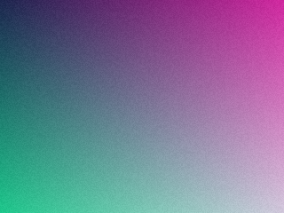
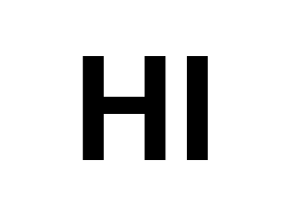
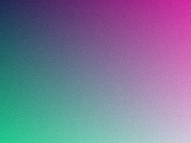

# Steganography

Hide a message image inside a cover image so the result looks visually identical to the cover.

This repo started as a study project — I wrote a few rough scripts to teach myself the basic idea (`legacy/`), then revisited it later with a more general approach (the code at the repo root). Both are kept here.

## How the current version works

The encoder manipulates only the **lowest few bits** of each pixel channel in the cover image:

- **Non-message pixels** — low bits are normalized so they are all `>= n` (a threshold)
- **Message foreground pixels** — one channel's low bits are set to `n - 1`, just below the threshold

The decoder simply scans the image: any pixel where at least one channel's low bits fall below `n` is a message pixel. Because only the lowest bits change, the maximum modification per channel is small (7 for the default threshold of 5) — invisible to the eye but cleanly recoverable.

## Setup

```bash
uv sync
```

## Usage

### Encode

```bash
uv run steg encode --cover photo.jpg --message secret.png --output stego.png
```

### Decode

```bash
uv run steg decode --input stego.png --output revealed.png
```

### Options

| Flag | Short | Default | Description |
|------|-------|---------|-------------|
| `--threshold` | `-n` | 5 | Low-bit threshold. Higher values use more bits — slightly more visible, but more robust to compression. |

Output **must** be `.png` — lossy formats like JPEG destroy the hidden data.

## Example

The `examples/` folder has a small generated cover, message, and the resulting stego image:

```bash
uv run steg encode -c examples/cover.png -m examples/message.png -o /tmp/stego.png
uv run steg decode -i /tmp/stego.png -o /tmp/revealed.png
```

| Cover | Message | Stego (encoded) |
|---|---|---|
|  |  |  |

The stego image looks identical to the cover, but `revealed.png` will show the message.

## How the message image is interpreted

- Converted to grayscale, then binarized at brightness `< 128`
- Dark pixels = message foreground (what gets hidden)
- Light pixels = background (ignored)
- Resized to match the cover dimensions if needed

## Tests

```bash
uv run pytest
```

## Legacy

The original 2-color study scripts live in [`legacy/`](legacy/). They only hide pure black-and-white images by replacing pixels of the rarer color in the cover — much more limited than the current version. They're preserved as the starting point for this study.

## License

MIT — see [LICENSE](LICENSE).
